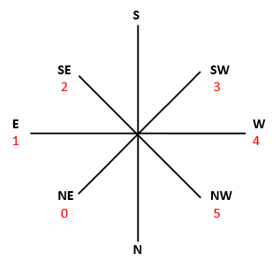

# Pong

## Authors

- Isaac Daly (idd17@uclive.ac.nz)
- Divyean Sivarman (dsi3@uclive.ac.nz)

## Game Overview

This game is called <b>_pong_</b>. The aim of the game is to not all the ball to pass the puck (more commonly called a paddle).

To load the game onto the board, go to the game's directory:

```shell
cd /ence260-ucfk4/assignment/group436
```

Then, `make` the program and transfer the executable files to both boards, by:

```shell
make
make program
```

Once both boards have the game loaded and are showing the welcome text, **press the _navswitch_ down**.

To move the puck/paddle, use the **tilt the _navswitch_ to the left and right** (assuming that the board is oriented such that the USB port is on the right).

Once the game is ended, the boards will notify each player if they won or lost.

**To play another game press the _navswitch_ down. To exit the application, press the _reset_ button**

The ball rebounds off the puck/paddle in the following ways:


## Getting the source

If the [ence260-ucfk4](https://eng-git.canterbury.ac.nz/rmc84/ence260-ucfk4) repository is not present:

```shell
git clone https://eng-git.canterbury.ac.nz/rmc84/ence260-ucfk4.git
```

Clone the repo into `/ence260-ucfk4/assignment/`

```shell
cd /ence260-ucfk4/assignment/
git clone https://eng-git.canterbury.ac.nz/ence260-2018/group436.git
```

## Technical information

This game requires two UCFK4 (University of Canterbury Fun Kit v4) boards, which contain an [ATmega32u2 microcontroller](http://ecewiki.elec.canterbury.ac.nz/mediawiki/index.php/Atmel_ATmega32u2), a reset push button, a general-purpose pushbutton, a five-way navigation switch, a green LED that indicates if power is on, a user switchable blue LED, a seven by five dot-matrix display, an infrared LED, a 36 kHz infrared receiver, and a USB connector. The USB connector provides 5 V to run the microcontroller and to allow programs to be up-loaded.

_UCFK4 data is per the [University of Canterbury UCFK4 wiki page](http://ecewiki.elec.canterbury.ac.nz/mediawiki/index.php/UCFK4)_.

### Display

The display is a 7 row × 5 column dot-matrix display.

The display, in terms of the board is thought of as the following:


The puck/paddle has its `bottom` towards the top of the display (i.e. it has a _lower_ value than the `top`).

### Compass/`Direction`

Compass directions, with the same orientiation as the board above:



## Code

The coding style is specified in [`.clang_format`](.clang_format). The general style mostly reflects the [ENCE260 style guidelines](https://learn.canterbury.ac.nz/pluginfile.php/529635/mod_resource/content/8/styleguidelines.html), with a few differences:

- In keeping with the variable and function name style in the APIs, variables and function names are lowercase with words separated by underscores, as necessary.
- `enum`s do not start with an uppercase, as this is used by their `typedef` definition.
